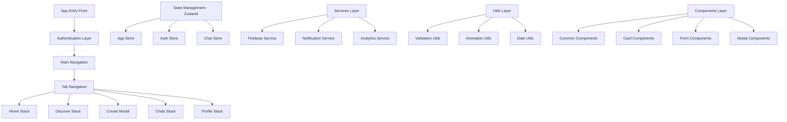

# Design Document

## Overview

This design document outlines the comprehensive completion strategy for the Nexus social event and hobby group platform. The design focuses on code quality improvements, feature completion, documentation enhancement, and production readiness while maintaining the existing UI-first approach with animated gradients and smooth 60fps animations.

## Architecture

### Current Architecture Assessment

The project follows a well-structured React Native Expo architecture with:
- **Frontend**: Expo Router with TypeScript
- **Styling**: NativeWind (Tailwind CSS) + React Native Reanimated
- **State Management**: Zustand
- **Backend**: Firebase (Firestore, Auth, Storage)
- **Navigation**: Expo Router with tab-based navigation

### Proposed Architecture Enhancements



## Components and Interfaces

### 1. Code Quality Enhancement System

#### Linting and Type Safety
```typescript
interface CodeQualityConfig {
  eslintRules: ESLintRule[];
  typescriptConfig: TypeScriptConfig;
  prettierConfig: PrettierConfig;
  husky: HuskyHooks;
}

interface LintFix {
  file: string;
  issues: LintIssue[];
  autoFixable: boolean;
  manualFixRequired: boolean;
}
```

#### Implementation Strategy
- Implement automated lint fixing for unused imports/variables
- Add proper TypeScript strict mode configuration
- Set up pre-commit hooks for code quality enforcement
- Create custom ESLint rules for project-specific patterns

### 2. Feature Completion Framework

#### Missing Feature Identification
```typescript
interface FeatureStatus {
  name: string;
  status: 'completed' | 'partial' | 'missing';
  components: ComponentStatus[];
  functionality: FunctionalityStatus[];
  priority: 'high' | 'medium' | 'low';
}

interface ComponentStatus {
  path: string;
  implemented: boolean;
  tested: boolean;
  documented: boolean;
}
```

#### Core Features to Complete
1. **Real-time Chat System**
   - Message persistence and synchronization
   - Typing indicators and read receipts
   - File/image sharing capabilities
   - Push notification integration

2. **Search and Discovery**
   - Advanced filtering system
   - Location-based search
   - Recommendation algorithm
   - Search result optimization

3. **User Profile Management**
   - Profile editing and validation
   - Social card generation
   - Privacy settings
   - Account management

### 3. Documentation System

#### Documentation Architecture
```typescript
interface DocumentationStructure {
  readme: ReadmeSection[];
  apiDocs: APIDocumentation;
  componentDocs: ComponentDocumentation[];
  architectureDocs: ArchitectureDocumentation;
  deploymentDocs: DeploymentDocumentation;
}

interface ReadmeSection {
  title: string;
  content: string;
  codeExamples: CodeExample[];
  screenshots: string[];
}
```

#### Documentation Components
- **README Enhancement**: Complete setup guide, feature overview, contribution guidelines
- **API Documentation**: Firebase integration, custom API endpoints, data models
- **Component Documentation**: Storybook integration, prop interfaces, usage examples
- **Architecture Documentation**: System design, data flow, security considerations

### 4. Performance Optimization System

#### Performance Monitoring
```typescript
interface PerformanceMetrics {
  screenLoadTimes: Record<string, number>;
  animationFrameRates: Record<string, number>;
  memoryUsage: MemoryMetrics;
  bundleSize: BundleMetrics;
}

interface OptimizationStrategy {
  imageOptimization: ImageOptimizationConfig;
  codesplitting: CodeSplittingConfig;
  caching: CachingStrategy;
  lazyLoading: LazyLoadingConfig;
}
```

#### Optimization Techniques
- Image compression and caching with expo-image
- Code splitting for route-based loading
- Memoization for expensive computations
- Virtual scrolling for large lists
- Bundle size optimization

### 5. Testing Framework

#### Test Architecture
```typescript
interface TestSuite {
  unitTests: UnitTest[];
  integrationTests: IntegrationTest[];
  e2eTests: E2ETest[];
  performanceTests: PerformanceTest[];
}

interface TestConfiguration {
  jest: JestConfig;
  detox: DetoxConfig;
  coverage: CoverageConfig;
  mocking: MockingStrategy;
}
```

#### Testing Strategy
- Unit tests for utilities and business logic
- Component testing with React Native Testing Library
- Integration tests for feature workflows
- E2E tests for critical user journeys
- Performance benchmarking

## Data Models

### Enhanced Data Models

#### User Model Enhancement
```typescript
interface User {
  id: string;
  email: string;
  name: string;
  avatar?: string;
  bio?: string;
  interests: string[];
  location?: Location;
  joinedAt: Date;
  lastActive: Date;
  preferences: UserPreferences;
  privacy: PrivacySettings;
  stats: UserStats;
}

interface UserPreferences {
  notifications: NotificationPreferences;
  theme: 'light' | 'dark' | 'system';
  language: string;
  accessibility: AccessibilitySettings;
}
```

#### Circle Model Enhancement
```typescript
interface Circle {
  id: string;
  name: string;
  description: string;
  bannerImage?: string;
  category: string;
  memberCount: number;
  maxMembers?: number;
  createdBy: string;
  location?: Location;
  createdAt: Date;
  updatedAt: Date;
  privacy: 'public' | 'private';
  rules?: string;
  tags: string[];
  stats: CircleStats;
}
```

#### Meetup Model Enhancement
```typescript
interface Meetup {
  id: string;
  circleId: string;
  title: string;
  description: string;
  date: Date;
  duration: number;
  location: Location;
  maxAttendees?: number;
  currentAttendees: number;
  images: string[];
  createdBy: string;
  createdAt: Date;
  updatedAt: Date;
  status: 'upcoming' | 'ongoing' | 'completed' | 'cancelled';
  tags: string[];
  requirements?: string[];
}
```

## Error Handling

### Comprehensive Error Handling Strategy

#### Error Types and Handling
```typescript
interface ErrorHandlingSystem {
  networkErrors: NetworkErrorHandler;
  validationErrors: ValidationErrorHandler;
  authenticationErrors: AuthErrorHandler;
  permissionErrors: PermissionErrorHandler;
  systemErrors: SystemErrorHandler;
}

interface ErrorHandler {
  catch: (error: Error) => void;
  log: (error: Error) => void;
  notify: (error: Error) => void;
  recover: (error: Error) => void;
}
```

#### Error Recovery Mechanisms
- Automatic retry for network failures
- Graceful degradation for feature unavailability
- User-friendly error messages
- Offline mode support
- Error reporting and analytics

### User Experience Error Handling
- Loading states for all async operations
- Empty states with actionable guidance
- Error boundaries for component isolation
- Toast notifications for user feedback
- Retry mechanisms with exponential backoff

## Testing Strategy

### Multi-Layer Testing Approach

#### 1. Unit Testing
- **Coverage Target**: 80% minimum
- **Tools**: Jest, React Native Testing Library
- **Focus**: Utilities, hooks, business logic
- **Mocking**: Firebase services, external APIs

#### 2. Component Testing
- **Snapshot Testing**: UI consistency verification
- **Interaction Testing**: User interaction simulation
- **Accessibility Testing**: Screen reader compatibility
- **Performance Testing**: Render time measurement

#### 3. Integration Testing
- **Feature Workflows**: End-to-end feature testing
- **API Integration**: Firebase service integration
- **Navigation Testing**: Route and navigation flow
- **State Management**: Store interaction testing

#### 4. E2E Testing
- **Critical Paths**: Authentication, core features
- **Cross-Platform**: iOS and Android testing
- **Performance**: Load time and responsiveness
- **Regression**: Automated regression testing

### Testing Infrastructure
```typescript
interface TestInfrastructure {
  testRunner: 'jest';
  e2eFramework: 'detox';
  mockingStrategy: MockingConfig;
  ciIntegration: CIConfig;
  reportGeneration: ReportConfig;
}
```

## Security Considerations

### Security Implementation Strategy

#### 1. Authentication Security
- Secure token storage using Expo SecureStore
- Token refresh mechanism
- Biometric authentication support
- Session management and timeout

#### 2. Data Security
- Input validation and sanitization
- SQL injection prevention
- XSS protection
- Secure API communication (HTTPS)

#### 3. Privacy Protection
- GDPR compliance implementation
- User consent management
- Data anonymization
- Right to deletion support

#### 4. Firebase Security Rules
```javascript
// Enhanced Firestore security rules
rules_version = '2';
service cloud.firestore {
  match /databases/{database}/documents {
    // User data protection
    match /users/{userId} {
      allow read, write: if request.auth != null && request.auth.uid == userId;
    }
    
    // Circle access control
    match /circles/{circleId} {
      allow read: if request.auth != null;
      allow write: if request.auth != null && 
        (resource == null || resource.data.createdBy == request.auth.uid);
    }
  }
}
```

## Deployment Strategy

### Production Deployment Pipeline

#### 1. Build Optimization
- Bundle size analysis and optimization
- Asset compression and optimization
- Code splitting implementation
- Tree shaking for unused code removal

#### 2. CI/CD Pipeline
```yaml
# GitHub Actions workflow example
name: Nexus CI/CD
on: [push, pull_request]
jobs:
  test:
    runs-on: ubuntu-latest
    steps:
      - uses: actions/checkout@v2
      - name: Setup Node.js
        uses: actions/setup-node@v2
      - name: Install dependencies
        run: npm ci
      - name: Run tests
        run: npm test
      - name: Run linting
        run: npm run lint
      - name: Build app
        run: npx expo build
```

#### 3. Release Management
- Semantic versioning implementation
- Automated changelog generation
- Over-the-air update strategy
- Rollback capability

#### 4. Monitoring and Analytics
- Crash reporting with Sentry
- Performance monitoring
- User analytics with Firebase Analytics
- Custom event tracking

This design provides a comprehensive roadmap for completing the Nexus project while maintaining code quality, performance, and user experience standards.